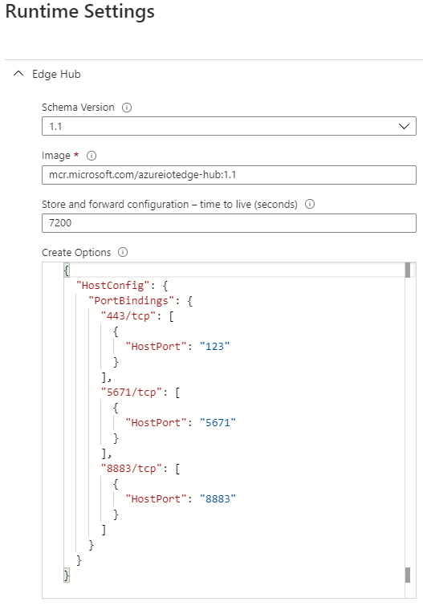

# azure-iot-edge
This repository contains instructions for building and starting a Microsoft Edge Runtime Container on WAGO devices. (e.g. PFC200 G2 or Wago Touch Panel)

# How to setup Azure Iot Edge on Wago Device

## Prerequisites for tutorial
- Preinstalled SSH Client (e.g. https://www.putty.org/)
- Microsoft Azure Account 
  - Firmware you can find here: https://github.com/WAGO/pfc-firmware
  - Docker IPKG you can find here: https://github.com/WAGO/docker-ipk 

## Microsoft Azure Wold 
### Create an Iot-Hub, add iot edge device and deviceDeploy your first IoT Edge Module: 
https://docs.microsoft.com/de-de/azure/iot-edge/quickstart-linux

> Attention: To prevent port "443" clashing of "edgeHub" container and of Wago Webserver, it is absolutely necessary to change the "HostBindings".   You can use any free host ports.

<br>
<div style="text-align: center">

</div>

## Wago Device Login
Start SSH Client e.g. Putty 
 ```bash
login as `root`
password `wago`
 ```
## Check docker installation

```bash
docker info
 ```

## Start azure iot edge runtime container. 
 ```bash
  docker run \
    -it \
    --net="host" \
    --name azure-iot-edge-runtime \
    -v //var//run//docker.sock://var//run//docker.sock \
    -v /etc/os-release:/etc/os-release
    -p 15580:15580 \
    -p 15581:15581 \
    -e IOT_DEVICE_CONNSTR="$MY_IOT_HUB_DEVICE_CONNSTR" \
    -e IOT_DEVICE_HOST_IP="$MY_WAGO_DEVICE_IPADDRESS" \
    wagoautomation/azure-iot-edge
  bin/bash
  ```

If the container was started successfully, all deployments defined in Microsoft Azure are automatically downloaded and started. 
<br>This may take a few minutes.
<br>With the Docker commands you can track the provisioning process. 
```bash
docker images 
docker ps
docker logs 
```

Finally, Wago device is ready for azure iot edge module deployment! <br>
Happy IoTing!

## Azure IoT Edge Modbus Module

You need a running Modbus Slave (Server) e.g. Wago Device or Modbus slave Simulator  

How to deploy microsoft modbus ingestion module see here: 
https://github.com/Azure/iot-edge-modbus


## Develop a C# IoT Edge module

How to develop your own azure iot edge module see here: 
https://docs.microsoft.com/en-us/azure/iot-edge/tutorial-csharp-module
