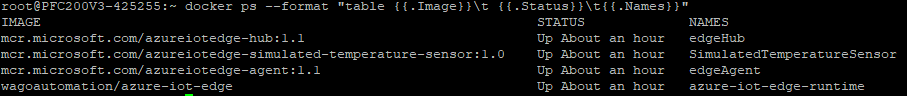

# How to setup Azure Iot Edge on Wago Device

## Prerequisites for tutorial
- Preinstalled SSH Client (e.g. https://www.putty.org/)
- Wago Device e.g. PFC200 G2 or Wago Touch Panel with minimal Firmware 12
  - Firmware you can find here: https://github.com/WAGO/pfc-firmware
  - Docker IPKG you can find here: https://github.com/WAGO/docker-ipk
- Microsoft Azure Account 
 

## Create an Iot-Hub, add iot edge device and deviceDeploy your first IoT Edge Module: 
https://docs.microsoft.com/de-de/azure/iot-edge/quickstart-linux

Please go through the following points:
- Create an IoT Hub.
- Register an IoT Edge device to your IoT hub.
- The section <span style="color:yellow;"> <strong>"Configure your IoT Edge device" </strong></span> can be completely ignored.
- Remotely deploy a SimulatedTemperatureSensor module to an IoT Edge device.


> <span style="color:red;"> Attention: </span> To prevent port <strong>"443"</strong> clashing of <strong>"edgeHub"</strong> container and of Wago Webserver, it is absolutely necessary to change the <strong>"HostBindings"</strong>.   You can use any free host ports.

<br>
<div style="text-align: center">

</div>

## Wago Device Login
Start SSH Client e.g. Putty 
 ```bash
login as `root`
password `wago`
 ```
## Check docker installation

```bash
docker info
 ```

## Start azure iot edge runtime container. 
 ```bash
  docker run \
    -it \
    --net="host" \
    --name azure-iot-edge-runtime \
    -v //var//run//docker.sock://var//run//docker.sock \
    -v /etc/os-release:/etc/os-release \
    -e IOT_DEVICE_CONNSTR="MY_IOT_HUB_DEVICE_CONNSTR" \
    -e IOT_DEVICE_HOST_IP="MY_WAGO_DEVICE_IPADDRESS" \
    wagoautomation/azure-iot-edge
  ```

After the container start, all deployments defined in Microsoft Azure are automatically downloaded and started. 
<br>This may take a few minutes.
<br>With the Docker commands you can track the provisioning process. 
```bash
docker images 
docker ps
docker logs 
```

After all containers have been started, the following Docker command should return the following:
```bash
docker ps --format "table {{.Image}}\t {{.Status}}\t{{.Names}}"
```

<br>
<div style="text-align: center">

</div>


The <strong>"SimulatedTemperatureSensor"</strong> module sends <strong>"500"</strong> simulation messages to your Iot Hub. The telemetry data can be displayed e.g. with a Visual Studio Code extension. (see: https://marketplace.visualstudio.com/items?itemName=vsciot-vscode.azure-iot-toolkit)

<br><br>
Finally, Wago device is ready for azure iot edge module deployment! <br>
Happy IoTing!

## Azure IoT Edge Modbus Module

You need a running Modbus Slave (Server) e.g. Wago Device or Modbus slave Simulator  

How to deploy microsoft modbus ingestion module see here: 
https://github.com/Azure/iot-edge-modbus


## Develop a C# IoT Edge module

How to develop your own azure iot edge module see here: 
https://docs.microsoft.com/en-us/azure/iot-edge/tutorial-csharp-module
